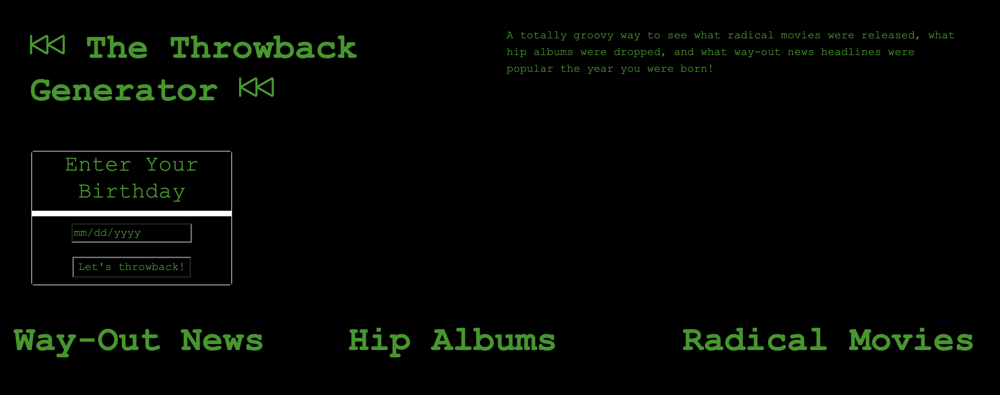

# <Throwback-Generator>

## Description:

Our team wanted to create an application that returned news, music and movies to a user when they entered their birthdate. We thought it would be fun and informative to receive news headlines from the date of your birth as well as movies and albums released the same year. Consider it a little window on history from the vantage of your birth. Thus, the 'Throwback-Generator'! Together we learned to integrate three distinct APIs in a simple, user-friendly application. We adopted a retro theme for the style in keeping with the overall concept.

## Installation and Usage:

Our application can be found at https://awnasworthy.github.io/throwback-generator/

Simply enter your birthdate and prepare to throwback!

## Built with:

- HTML
- CSS
- JavaScript

## Credits

The Throwback-Generator was created by three developers:

- Ally Nasworthy https://github.com/awnasworthy
- Skylar Jackson https://github.com/Doctor-Worm
- Jonathan Price https://github.com/jonprice0

The Throwback-Generator relies for its time-warping magic on three third-party APIs:

- The New York Times: https://developer.nytimes.com/apis
- Musicbrainz: https://musicbrainz.org/doc/MusicBrainz_AP
- IMDB: https://imdb-api.com/

## License

BSD 2-Clause License

Copyright (c) 2022, Throwback-Generator

Redistribution and use in source and binary forms, with or without
modification, are permitted provided that the following conditions are met:

1. Redistributions of source code must retain the above copyright notice, this
   list of conditions and the following disclaimer.

2. Redistributions in binary form must reproduce the above copyright notice,
   this list of conditions and the following disclaimer in the documentation
   and/or other materials provided with the distribution.

THIS SOFTWARE IS PROVIDED BY THE COPYRIGHT HOLDERS AND CONTRIBUTORS "AS IS"
AND ANY EXPRESS OR IMPLIED WARRANTIES, INCLUDING, BUT NOT LIMITED TO, THE
IMPLIED WARRANTIES OF MERCHANTABILITY AND FITNESS FOR A PARTICULAR PURPOSE ARE
DISCLAIMED. IN NO EVENT SHALL THE COPYRIGHT HOLDER OR CONTRIBUTORS BE LIABLE
FOR ANY DIRECT, INDIRECT, INCIDENTAL, SPECIAL, EXEMPLARY, OR CONSEQUENTIAL
DAMAGES (INCLUDING, BUT NOT LIMITED TO, PROCUREMENT OF SUBSTITUTE GOODS OR
SERVICES; LOSS OF USE, DATA, OR PROFITS; OR BUSINESS INTERRUPTION) HOWEVER
CAUSED AND ON ANY THEORY OF LIABILITY, WHETHER IN CONTRACT, STRICT LIABILITY,
OR TORT (INCLUDING NEGLIGENCE OR OTHERWISE) ARISING IN ANY WAY OUT OF THE USE
OF THIS SOFTWARE, EVEN IF ADVISED OF THE POSSIBILITY OF SUCH DAMAGE.

